# Introduction

Most Rubik's Cube tutorials teach the beginner method, then expect you to jump straight to CFOP speed-solving. The problem: the two methods use **different last-layer orders**, and the beginner algorithms break when you switch.

**Beginner order:** Yellow Cross → Align Edges → Position Corners → Orient Corners

**CFOP order:** Yellow Cross → Orient Corners → Position Corners → Align Edges

This guide takes a **3-phase approach** that eliminates the dead zone between methods:

- **Phase 1** — Learn the beginner method (traditional order). Solve the cube reliably.
- **Phase 2** — Switch to CFOP order with just 5 new algorithms. Eliminate the two slowest beginner steps immediately.
- **Phase 3** — Complete 2-Look CFOP with 6 more algorithms. Every case now solved in one algorithm.

**The building-block philosophy:** nearly every new algorithm is built from triggers you already know. The sexy move, Sune, and F-sexy-F' reappear everywhere. When you see familiar pieces inside a new algorithm, it's easier to learn and faster to recall.

Hold the cube with **white on the bottom, yellow on top** throughout this guide.

# Notation

Each letter represents turning a face 90° clockwise (as if looking directly at that face). An apostrophe (') means counterclockwise. A "2" means 180°.

## Standard Moves

| Move | Meaning |
|------|---------|
| `R` / `R'` | Right face clockwise / counterclockwise |
| `U` / `U'` | Up (top) face clockwise / counterclockwise |
| `L` / `L'` | Left face clockwise / counterclockwise |
| `F` / `F'` | Front face clockwise / counterclockwise |
| `D` / `D'` | Down (bottom) face clockwise / counterclockwise |
| `R2`, `U2`, etc. | Half turn (180°) |

## Special Notation

| Move | Meaning |
|------|---------|
| `f` / `r` (lowercase) | Wide move — turn front/right two layers together |
| `M` | Middle layer (same direction as L) |
| `M2` | Middle layer 180° |
| `x` / `y` / `z` | Rotate entire cube (R / U / F direction) |

> **The Sexy Move / Righty Alg: `R U R' U'`**
>
> This 4-move sequence is the most important trigger in cubing. It flows naturally in your right hand and appears everywhere: F2L, OLL setups, and inside many longer algorithms. Practice it until it's pure muscle memory.

# Phase 1: Beginner Method

Master this first — it builds all the fundamentals you need.

## Step 1: White Cross (Intuitive)

Build a white cross on the bottom, matching each edge's side color to its center. No algorithms needed — just move white edges to the bottom while color-matching. Plan ahead before turning.

## Step 2: White Corners

Position a white corner piece above its correct bottom-layer spot, then use the Righty or Lefty Alg depending on which way the white sticker faces:

| White sticker faces | Algorithm | Notes |
|---------------------|-----------|-------|
| Right | `R U R' U'` | 1× Righty Alg |
| Front | `(R U R' U')` ×3 | 3× Righty |
| Up | `(R U R' U')` ×5 | 5× Righty |
| Left | `L' U' L U` | 1× Lefty Alg |

**Corner stuck in the bottom?** Hold it on the right and do one Righty Alg to pop it out. Then solve normally.

## Step 3: Middle-Layer Edges

Find a top-layer edge without yellow. Turn U until its front color matches the center below. Then:

| Edge needs to go | Algorithm |
|------------------|-----------|
| Right | `U (R U R' U') y' (L' U' L U)` |
| Left | `U' (L' U' L U) y (R U R' U')` |

If an edge is stuck in the wrong slot, push it out by inserting any top-layer edge into that position.

## Last Layer (Beginner Order)

> **Beginner Last Layer Order**
>
> Step 4: Yellow Cross (orient edges) → Step 5: Align Edges (permute edges) → Step 6: Position Corners (permute corners) → Step 7: Orient Corners (orient corners)
>
> This order works because each step's algorithm is designed for the current state. We switch this order in Phase 2.

### Step 4: Yellow Cross

Flip the cube so yellow is on top. Look at the yellow edges on the top face:

| You see | Algorithm | Setup |
|---------|-----------|-------|
| Dot (no edges) | `F (R U R' U') F'` twice | Dot → Hook → Cross |
| Hook / L-shape | `F (R U R' U') F'` | Hold L in back-left |
| Line | `F (R U R' U') F'` | Hold line horizontal |

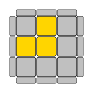{ width=15% }
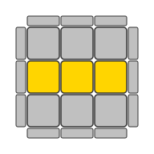{ width=15% }
{ width=15% }

> **Just one algorithm!** `F (R U R' U') F'` = F + Sexy Move + F'. You already know the Sexy Move, so this is just wrapping it with F and F'.

### Step 5: Align Yellow Edges

The yellow cross is made, but edges may not match their side centers. Turn U to match as many as possible, then:

**Two adjacent edges correct:** Hold the two solved edges at the BACK and RIGHT, then:

> **Edge Cycle: `R U R' U R U2 R' U`**
>
> This is Sune (`R U R' U R U2 R'`) + U. Cycles the remaining three edges.

**Two opposite edges correct:** Do Sune + U from any angle — this gives you two adjacent solved edges. Then hold them back-right and repeat.

**No edges correct:** Do the algorithm once from any angle, then realign and try again.

### Step 6: Position Yellow Corners

Get each corner into its correct position (side colors match neighboring centers). The corner may be twisted wrong — that's fine, we only care about position.

Find a corner already in the right position. Hold it in the FRONT-RIGHT-TOP and do:

> **Niklas (Corner 3-Cycle): `R U' L' U R' U' L`**
>
> Cycles the other three corners. The front-right corner stays. Repeat if needed.

**No corner in the right spot?** Do Niklas from any angle. After one execution, at least one corner will be correct.

> **Niklas disrupts orientation — that's OK here!** Niklas moves corners but does NOT preserve which way yellow faces. This is fine because we haven't oriented corners yet — that's the next step. This is exactly why the beginner order works: permute THEN orient.

### Step 7: Orient Yellow Corners

All corners are in the right position but some have yellow facing the wrong way. Twist each corner individually:

1. Hold yellow on TOP. Find a corner where yellow is NOT facing up.
2. Rotate so that unsolved corner is in the FRONT-RIGHT-TOP position.
3. Repeat `(R U R' U')` until that corner's yellow sticker faces up (2 or 4 repetitions).
4. **DO NOT rotate the cube!** Turn ONLY the U layer to bring the next unsolved corner to front-right-top.
5. Repeat steps 3–4 until all corners show yellow on top.

> **Don't panic!** The cube will look completely scrambled while you do this. As long as you ONLY turn the U layer between corners (never rotate the whole cube or turn other layers), everything will fall into place once all four corners are oriented. Trust the process.

After all corners are oriented, one final U turn may be needed. The cube is solved!

## Phase 1 Summary

| # | Algorithm | Name | Used for |
|---|-----------|------|----------|
| 1 | `R U R' U'` | Sexy Move / Righty Alg | Everywhere |
| 2 | `L' U' L U` | Lefty Alg | White corners (mirror) |
| 3 | `F (R U R' U') F'` | F-sexy-F' | Yellow cross |
| 4 | `R U R' U R U2 R'` | Sune | Edge alignment (+U) |
| 5 | `R U' L' U R' U' L` | Niklas | Corner positioning |
| 6 | Repeat `(R U R' U')` | — | Corner orientation |

**Goal:** Solve the cube consistently. Get comfortable and build speed before upgrading.

# Phase 2: CFOP Switch (+5 New Algorithms)

Phase 2 switches to CFOP last-layer order and eliminates the two slowest beginner steps:

- **Repeated sexy move** for corner orientation (~48 moves avg) → **Sune/Anti-Sune** (~12 moves avg, 4× faster)
- **Niklas** for corner positioning → **T-perm/Y-perm** (works with completed yellow face)
- **Sune+U** for edge alignment → **Ua/Ub** (works after corners are solved)

> **New Last Layer Order**
>
> OE (Yellow Cross) → **OC** (Orient Corners) → **PC** (Position Corners) → **PE** (Align Edges)
>
> All orientation first, then all permutation. This is the CFOP order — it never changes again.

## Updated Yellow Cross (Free Upgrade)

Same concept, but the Line case gets its own efficient algorithm:

| You see | Algorithm | Notes |
|---------|-----------|-------|
| Dot | `F (R U R' U') F'` then `f (R U R' U') f'` | Hook, then Line |
| Hook | `F (R U R' U') F'` | Hold L in back-left |
| Line | `f (R U R' U') f'` | **Wide `f`**, hold line horizontal |

{ width=15% }
{ width=15% }
{ width=15% }

> The Line case now uses `f` (lowercase = front two layers) instead of `F`. For the Dot, do Hook first, then Line.

## Orient Corners: Sune + Anti-Sune

After the yellow cross, look at the four corners. Instead of repeated sexy moves (which took ~48 moves on average), use Sune to reduce any case to Sune or Anti-Sune:

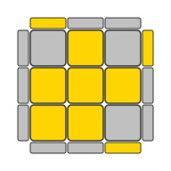{ width=15% }
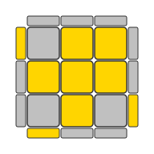{ width=15% }

| Case | Algorithm | Building blocks |
|------|-----------|-----------------|
| Sune | `R U R' U R U2 R'` | Already known from Phase 1! |
| Anti-Sune | `R U2 R' U' R U' R'` | Reverse of Sune |

**Learning strategy:** Start by learning just Anti-Sune. For any other corner case, apply Sune repeatedly until you get a Sune or Anti-Sune case (1–3 applications). This already cuts ~48 moves down to ~12 on average.

The remaining 5 corner OLL cases (Pi, Headlights, Chameleon, Bowtie, all-solved) are covered in Phase 3.

## Permute Corners: T-Perm + Y-Perm

The entire yellow face is now complete. Look at the side colors of the corners — turn U to check each face for **headlights** (two corners on the same face sharing the same side color).

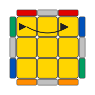{ width=15% }
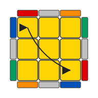{ width=15% }

| Case | Algorithm | Building blocks |
|------|-----------|-----------------|
| Headlights on one face | `R U R' U' R' F R2 U' R' U' R U R' F'` (T-Perm) | Starts with sexy move |
| No headlights | `F R U' R' U' R U R' F' R U R' U' R' F R F'` (Y-Perm) | Two identifiable halves |
| All corners match | Skip! | — |

Hold headlights at the **BACK** for T-Perm. For Y-Perm (diagonal swap), execute from any angle.

> **Why not Niklas?** Niklas destroys the yellow face you just built. T-Perm and Y-Perm swap corners while preserving the entire yellow face — that's what makes PLL algorithms special.

## Permute Edges: Ua + Ub

All corners are now correct. Turn U to see if any edge matches its center:

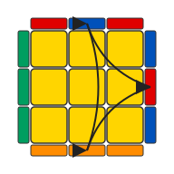{ width=15% }
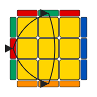{ width=15% }

| Case | Algorithm | Notes |
|------|-----------|-------|
| 3-cycle (one solved edge) | `M2 U M U2 M' U M2` (Ua) | Hold solved edge at BACK |
| 3-cycle (other direction) | `M2 U' M U2 M' U' M2` (Ub) | Hold solved edge at BACK |
| No single edge solved | Do Ua → get a U-perm → do Ub | H/Z cases (2 passes) |

> **New finger trick: M-slice moves.** These are the first genuinely new motions you need to learn. `M` turns the middle layer in the same direction as `L`. Practice `M2` (180° middle layer) until smooth — it's used in all 4 edge PLL algorithms.

**How to tell Ua from Ub:** Hold the solved edge at the back. If the front edge needs to go right, it's Ua. If it needs to go left, it's Ub. If you guess wrong, just do the other one.

## Phase 2 Summary

| # | Algorithm | Name | Replaces | Building blocks |
|---|-----------|------|----------|-----------------|
| 1 | `R U2 R' U' R U' R'` | Anti-Sune | Repeated sexy (OC) | Reverse of Sune |
| 2 | `R U R' U' R' F R2 U' R' U' R U R' F'` | T-Perm | Niklas (PC) | Starts with sexy move |
| 3 | `F R U' R' U' R U R' F' R U R' U' R' F R F'` | Y-Perm | Niklas diagonal (PC) | Two halves |
| 4 | `M2 U M U2 M' U M2` | Ua Perm | Sune+U (PE) | M-slice |
| 5 | `M2 U' M U2 M' U' M2` | Ub Perm | Sune+U (PE) | Reverse of Ua |

**New LL order:** OE → OC (Sune/Anti-Sune) → PC (T/Y-Perm) → PE (Ua/Ub)

**What you've gained:** The two slowest beginner steps are gone. Corner orientation is 4× faster. Every phase is self-contained — you can solve the cube after learning just this phase.

# Phase 3: Complete 2-Look CFOP (+6 New Algorithms)

Phase 3 fills in the remaining cases so every OLL and PLL situation is solved in **one algorithm** instead of multiple applications.

## OLL Corners: 4 New Cases

In Phase 2, you used repeated Sune to reduce unknown cases. Now learn the remaining 4 corner cases directly:

{ width=15% }
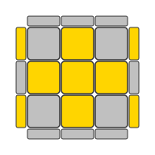{ width=15% }
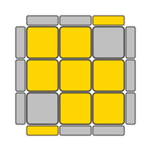{ width=15% }
{ width=15% }

| # | Case | Algorithm | Building blocks |
|---|------|-----------|-----------------|
| 1 | Pi / Double Sune | `f (R U R' U') f' F (R U R' U') F'` | **Line + Hook — zero new triggers!** |
| 2 | Chameleon | `r U R' U' r' F R F'` | Wide-r sexy variant + sledgehammer |
| 3 | Bowtie | `F' r U R' U' r' F R` | Similar to Chameleon, rearranged |
| 4 | Headlights | `R2 D R' U2 R D' R' U2 R'` | New D-move pattern (hardest OLL case) |

> **Pi = Line + Hook!** The Pi algorithm is literally `f(sexy)f'` followed by `F(sexy)F'` — the Line and Hook algorithms you already know, back to back. Zero new triggers needed.

**All 7 corner OLL cases:**

{ width=12% }
{ width=12% }
{ width=12% }
{ width=12% }
{ width=12% }
{ width=12% }
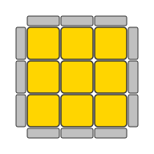{ width=12% }

## PLL Edges: 2 New Cases

In Phase 2, H and Z cases required two passes (Ua then Ub). Now solve them directly:

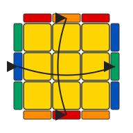{ width=15% }
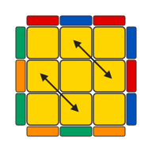{ width=15% }

| # | Case | Algorithm | Building blocks |
|---|------|-----------|-----------------|
| 5 | H-Perm (opposite swap) | `M2 U' M2 U2 M2 U' M2` | Pure M-slice — extends Phase 2 |
| 6 | Z-Perm (adjacent swap) | `M' U' M2 U' M2 U' M' U2 M2` | Pure M-slice |

> **How to tell H from Z:** If no edges match after any U turn, check the colors across from each other. Opposite colors facing each other = H-Perm. Adjacent colors = Z-Perm.

## Phase 3 Summary

| # | Algorithm | Name | Building blocks |
|---|-----------|------|-----------------|
| 1 | `f (R U R' U') f' F (R U R' U') F'` | Pi | Line + Hook |
| 2 | `r U R' U' r' F R F'` | Chameleon | Wide-r sexy variant |
| 3 | `F' r U R' U' r' F R` | Bowtie | Rearranged Chameleon |
| 4 | `R2 D R' U2 R D' R' U2 R'` | Headlights | D-move pattern |
| 5 | `M2 U' M2 U2 M2 U' M2` | H-Perm | M-slice |
| 6 | `M' U' M2 U' M2 U' M' U2 M2` | Z-Perm | M-slice |

# Complete Algorithm Reference

All 17 algorithms in learning order, grouped by phase.

## Phase 1: Beginner Method (~6 Algorithms)

| Algorithm | Name | Step |
|-----------|------|------|
| `R U R' U'` | Sexy Move / Righty Alg | Corners, F2L, OC |
| `L' U' L U` | Lefty Alg | Corners (mirror) |
| `F (R U R' U') F'` | F-sexy-F' (Hook) | Yellow cross (OE) |
| `R U R' U R U2 R'` | Sune | Edge alignment (PE) |
| `R U' L' U R' U' L` | Niklas | Corner position (PC) |
| Repeat `(R U R' U')` | — | Corner orient (OC) |

## Phase 2: CFOP Switch (+5 Algorithms)

| Algorithm | Name | Replaces |
|-----------|------|----------|
| `R U2 R' U' R U' R'` | Anti-Sune | Repeated sexy (OC) |
| `R U R' U' R' F R2 U' R' U' R U R' F'` | T-Perm | Niklas (PC) |
| `F R U' R' U' R U R' F' R U R' U' R' F R F'` | Y-Perm | Niklas diagonal (PC) |
| `M2 U M U2 M' U M2` | Ua Perm | Sune+U (PE) |
| `M2 U' M U2 M' U' M2` | Ub Perm | Sune+U (PE) |

## Phase 3: Complete 2-Look CFOP (+6 Algorithms)

| Algorithm | Name | Category |
|-----------|------|----------|
| `f (R U R' U') f' F (R U R' U') F'` | Pi / Double Sune | OLL corners |
| `r U R' U' r' F R F'` | Chameleon | OLL corners |
| `F' r U R' U' r' F R` | Bowtie | OLL corners |
| `R2 D R' U2 R D' R' U2 R'` | Headlights | OLL corners |
| `M2 U' M2 U2 M2 U' M2` | H-Perm | PLL edges |
| `M' U' M2 U' M2 U' M' U2 M2` | Z-Perm | PLL edges |

## Algorithm Progression

| Phase | New Algs | Total | LL Order |
|-------|----------|-------|----------|
| 1: Beginner | ~6 | ~6 | OE → PE → PC → OC |
| 2: CFOP Switch | +5 | ~11 | OE → OC → PC → PE |
| 3: Full 2-Look | +6 | ~17 | OE → OC → PC → PE |

## Updated Yellow Cross (Phases 2–3)

| Algorithm | Name | Setup |
|-----------|------|-------|
| `F (R U R' U') F'` | Hook | Hold L in back-left |
| `f (R U R' U') f'` | Line | Wide `f`, hold line horizontal |
| Hook then Line | Dot | Two algorithms back-to-back |

# Tips and Next Steps

**Practice tips:**

- Master each phase completely before moving on. Aim for consistent sub-3-minute solves before Phase 2.
- Learn algorithms in the order presented — each one builds on familiar triggers.
- For corner OLL in Phase 2, start with just Anti-Sune. Use repeated Sune for unknown cases until you learn Phase 3.
- Practice M-slice finger tricks separately before drilling Ua/Ub.

**What's next after 2-Look CFOP:**

- **F2L (First Two Layers):** Replace the beginner corner+edge insertion with intuitive F2L pairs. This is the single biggest speed improvement.
- **Full OLL (57 algorithms):** Solve the yellow face in one algorithm from any state.
- **Full PLL (21 algorithms):** Solve the last layer permutation in one algorithm.
- **Cross planning:** Plan the entire white cross during inspection (15 seconds).
- **Look-ahead:** Start planning the next step while executing the current one.
