# Introduction

This guide bridges the gap from beginner to CFOP in 3 phases:

1. **Phase 1** — Beginner method. Solve the cube reliably.
2. **Phase 2** — Switch to CFOP last-layer order with 3 new algorithms.
3. **Phase 3** — Complete 2-Look CFOP with 8 more algorithms.

**Key idea:** nearly every new algorithm reuses triggers you already know — the [sexy move]{.trig-r}, Sune, and F-sexy-F'.

Hold the cube with **white on bottom, yellow on top** throughout.

# Notation

Each letter = one 90° turn, clockwise when looking at that face.
Add **'** (prime) for counterclockwise. Add **2** for 180°.

**Face Moves** — the six faces of the cube:

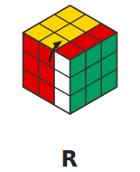{ width=10% }
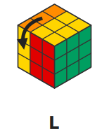{ width=10% }
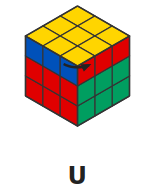{ width=10% }
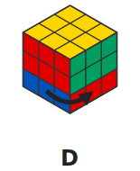{ width=10% }
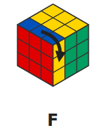{ width=10% }
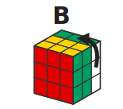{ width=10% }

**Other Moves** — primes, doubles, and wide turns:

An apostrophe **'** reverses the move (counterclockwise). A **2** means turn 180°.
Lowercase = wide move (two layers). These modifiers apply to any face move.

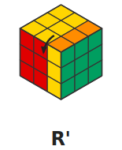{ width=10% }
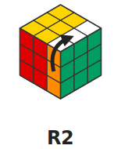{ width=10% }
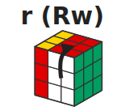{ width=10% }

**Cube Rotations** (dashed arrow) — the whole cube turns, no layer stays fixed:

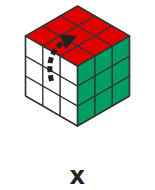{ width=10% }
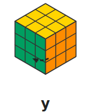{ width=10% }
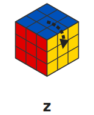{ width=10% }

**x** follows R · **y** follows U · **z** follows F

**Slice Moves** — turn only the middle layer:

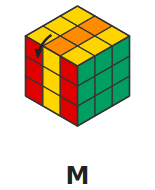{ width=10% }
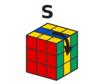{ width=10% }
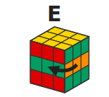{ width=10% }

**M** follows L · **S** follows F · **E** follows D

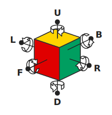{ width=40% }

> **Sexy Move:** [`R U R' U'`]{.trig-r} — The most important trigger in cubing. Practice until it's muscle memory.

# Phase 1: Beginner Method

## White Cross (Intuitive)

Build a white cross on the bottom, matching each edge's side color to its center. No algorithms — plan ahead, then execute.

## White Corners

Position a white corner above its correct slot, then:

| White sticker faces | Algorithm |
|---------------------|-----------|
| Right | [R U R' U']{.trig-r} (1× Righty) |
| Front | ([R U R' U']{.trig-r}) ×3 |
| Up | ([R U R' U']{.trig-r}) ×5 |
| Left | `L' U' L U` (1× Lefty) |

Corner stuck in bottom? One Righty pops it out.

## Middle-Layer Edges

Find a top-layer edge without yellow. Turn U until its front color matches the center below.

| Edge goes | Algorithm |
|-----------|-----------|
| Right | `U` [R U R' U']{.trig-r} `y'` `L' U' L U` |
| Left | `U'` `L' U' L U` `y` [R U R' U']{.trig-r} |

Wrong slot? Insert any top-layer edge to push it out.

## Yellow Cross

Flip the cube — yellow on top. One algorithm handles all cases:

> **F-sexy-F':** `F` [R U R' U']{.trig-r} `F'` — Sexy Move wrapped with F/F'.

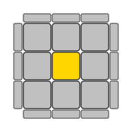{ width=15% }
{ width=15% }
{ width=15% }

| You see | Action |
|---------|--------|
| Dot | Apply once → Hook or Line. Orient, apply again |
| Hook | Apply once → Line. Hold line horizontal, apply again |
| Line | Hold line **horizontal**, apply once |

## Align Yellow Edges

Turn U to match as many edges as possible to their centers.

> **Sune + U:** [`R U R' U`]{.trig-g} `R U2 R' U` — cycles 3 edges.

- **Two adjacent correct:** Hold them at back + right, apply once.
- **Two opposite correct:** Apply from any angle → gives adjacent, then repeat.
- **None correct:** Apply once, realign, repeat.

## Position Yellow Corners

Find a corner in its correct position (colors match neighboring centers — twist doesn't matter). Hold it at **front-right-top**.

> **Niklas:** `R U' L' U R' U' L` — cycles the other 3 corners. Repeat if needed.

No correct corner? Apply from any angle — one will land correctly. Niklas disrupts orientation — that's OK here since we orient corners next.

## Orient Yellow Corners

1. Hold an unsolved corner at front-right-top.
2. Repeat [R U R' U']{.trig-r} until its yellow faces up (2 or 4 reps).
3. Turn **only U** to bring the next unsolved corner to front-right-top.
4. Repeat until done. One final U turn may be needed.

::: caution
The cube looks scrambled mid-step. Trust the process: only turn U between corners, never rotate the cube or turn other layers.
:::

# Phase 2: CFOP Switch (+3 Algorithms)

Switch to CFOP last-layer order: **OE → OC → PC → PE** (all orientation first, then all permutation). This never changes again.

Each section teaches ONE algorithm — enough to solve every case. Learning the pair is the natural next step — see Phase 3.

## Yellow Cross (Updated)

The Hook case gets its own efficient algorithm using wide `f`:

{ width=15% }
{ width=15% rotate=180 }
{ width=15% }

| You see | Algorithm |
|---------|-----------|
| Dot | `F` [R U R' U']{.trig-r} `F'` then `f` [R U R' U']{.trig-r} `f'` |
| Hook | `f` [R U R' U']{.trig-r} `f'` — wide `f`, hold L in **front-right** |
| Line | `F` [R U R' U']{.trig-r} `F'` — hold line **horizontal** |

## Orient Corners: Sune

After the cross, look at the four corners. **Learn Sune — apply it repeatedly for unknown cases.**

::: algorithm
| | Case | Algorithm |
|---|------|-----------|
| { width=60px } | **Sune** — 1 yellow corner, others CW | [`R U R' U`]{.trig-g} `R U2 R'` |
:::

For any unrecognized corner pattern, apply Sune until you reach a solved or Sune state. Anti-Sune + the remaining 5 corner cases are in Phase 3.

## Permute Corners: T-Perm

Yellow face complete. Check side colors for **headlights** (two matching corners on one face).

::: algorithm
| | Case | Algorithm |
|---|------|-----------|
| 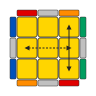{ width=60px } | **T-Perm** — headlights on one face, hold at **left** | [R U R' U']{.trig-r} [R' F]{.trig-b} `R2 U' R'` `U'` [R U R' F']{.trig-r} |
:::

- **No headlights (diagonal swap)?** Apply T-Perm → creates headlights → T-Perm again.
- **All corners match?** Skip.

Y-Perm (dedicated diagonal solver) in Phase 3.

::: caution
Niklas can't be used here — it destroys the yellow face. T-Perm swaps corners while preserving it.
:::

## Permute Edges: Ub

Corners done. Turn U — find the solved edge, hold it at **back**.

::: algorithm
| | Case | Algorithm |
|---|------|-----------|
| 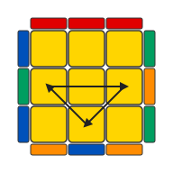{ width=60px } | **Ub** — front edge → left | `R2 U` [R U R' U']{.trig-r} `R' U'` `R' U R'` |
:::

- **No single solved edge?** Apply Ub → creates a solved edge → identify direction, apply again.

Ua (M-slice version) in Phase 3.

# Phase 3: Complete 2-Look CFOP (+8 Algorithms)

Every OLL and PLL case now solved in **one algorithm**. This phase introduces M-slice moves and completes each algorithm pair.

## Orient Corners: Anti-Sune + 4 New Cases

Anti-Sune completes the Sune pair. The remaining 4 cases each have a dedicated algorithm.

::: algorithm
| | Case | Algorithm |
|---|------|-----------|
| { width=60px } | **Anti-Sune** — 1 yellow corner, others CCW | `R U2 R' U' R U' R'` |
| 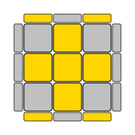{ width=60px } | **Pi** — 0 yellow, Π on front/back | `f` [R U R' U']{.trig-r} `f' F` [R U R' U']{.trig-r} `F'` |
| { width=60px } | **Headlights** — 0 yellow, headlights L+R | `R2 D R' U2 R D' R' U2 R'` |
| { width=60px } | **Chameleon** — 2 diagonal yellow | `r U R' U' r'` [F R F']{.trig-b} |
| 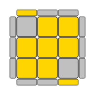{ width=60px } | **Bowtie** — 2 diagonal yellow | `F' r U R' U' r'` `F R` |
:::

## Permute Corners: Y-Perm

Completes the T-Perm pair. Solves diagonal corner swaps directly (no double T-Perm needed).

::: algorithm
| | Case | Algorithm |
|---|------|-----------|
| 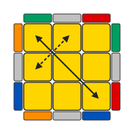{ width=60px } | **Y-Perm** — no headlights, any angle | `F R U' R' U'` [R U R' F']{.trig-r} [R U R' U']{.trig-r} [R' F R F']{.trig-b} |
:::

## Permute Edges: Ua + H-Perm + Z-Perm

**M-slice moves** (`M` turns the middle layer like `L`). Practice `M2` until smooth — Ua, H-Perm, and Z-Perm all use it.

::: algorithm
| | Case | Algorithm |
|---|------|-----------|
| 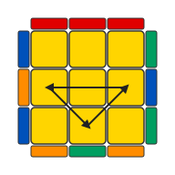{ width=60px } | **Ua** — front edge → right | `R U' R U R U R U' R' U' R2` |
| 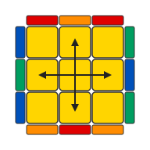{ width=60px } | **H-Perm** — opposite swap | `M2 U' M2 U2 M2 U' M2` |
| 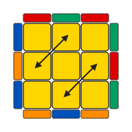{ width=60px } | **Z-Perm** — adjacent swap | `M' U' M2 U' M2 U' M' U2 M2` |
:::

**H vs Z:** No edges match after any U turn. Opposite colors facing each other = H. Adjacent colors = Z.

# Algorithm Reference

| Phase | Algorithm | Name | Step |
|-------|-----------|------|------|
| 1 | [`R U R' U'`]{.trig-r} | Sexy Move | Everywhere |
| 1 | `L' U' L U` | Lefty | White corners |
| 1 | `F` [`R U R' U'`]{.trig-r} `F'` | F-sexy-F' | OE |
| 1 | [`R U R' U`]{.trig-g} `R U2 R'` | Sune | PE (+U) |
| 1 | `R U' L' U R' U' L` | Niklas | PC |
| 1 | Repeat [`R U R' U'`]{.trig-r} | — | OC |
| 2 | [`R U R' U`]{.trig-g} `R U2 R'` | Sune | OC |
| 2 | [`R U R' U'`]{.trig-r} [`R' F`]{.trig-b} `R2 U' R' U'` [`R U R' F'`]{.trig-r} | T-Perm | PC |
| 2 | `R2 U` [`R U R' U'`]{.trig-r} `R' U' R' U R'` | Ub | PE |
| 3 | `R U2 R' U' R U' R'` | Anti-Sune | OC |
| 3 | `f` [`R U R' U'`]{.trig-r} `f' F` [`R U R' U'`]{.trig-r} `F'` | Pi | OC |
| 3 | `R2 D R' U2 R D' R' U2 R'` | Headlights | OC |
| 3 | `r U R' U' r'` [`F R F'`]{.trig-b} | Chameleon | OC |
| 3 | `F' r U R' U' r' F R` | Bowtie | OC |
| 3 | `F R U' R' U'` [`R U R' F'`]{.trig-r} [`R U R' U'`]{.trig-r} [`R' F R F'`]{.trig-b} | Y-Perm | PC |
| 3 | `R U' R U R U R U' R' U' R2` | Ua | PE |
| 3 | `M2 U' M2 U2 M2 U' M2` | H-Perm | PE |
| 3 | `M' U' M2 U' M2 U' M' U2 M2` | Z-Perm | PE |

## Progression

| Phase | New | Total | LL Order |
|-------|-----|-------|----------|
| 1: Beginner | ~6 | ~6 | OE → PE → PC → OC |
| 2: CFOP Switch | +3 | ~9 | OE → OC → PC → PE |
| 3: Full 2-Look | +8 | ~17 | OE → OC → PC → PE |

# What's Next

- **F2L:** Replace beginner corner+edge insertion with intuitive pairs — the biggest speed improvement.
- **Full OLL** (57 algs) / **Full PLL** (21 algs) / **Cross planning** / **Look-ahead**.
