# Introduction

This guide bridges the gap from beginner to CFOP in 3 phases:

1. **Phase 1** — Beginner method. Solve the cube reliably.
2. **Phase 1.5** — Speed tricks: white cross on bottom, wide-f Hook, orient corners without flipping.
3. **Phase 2** — Switch to CFOP last-layer order with 2 new algorithms.
4. **Phase 3** — Complete 2-Look CFOP with 10 more algorithms.

**Key idea:** nearly every new algorithm reuses triggers you already know — the [sexy move]{.trig-r}, Sune, and F-sexy-F'.

Hold the cube with **white on bottom, yellow on top** throughout.

Interactive version — every case playable in 3D, plus trainer and full CFOP: **cubepath-six.vercel.app** (free, works offline).

```{=typst}
#pagebreak()
```

# Notation

Each letter = one 90° CW turn, looking at that face — so from your seat L, D and B look CCW. **'** = CCW, **2** = 180°, lowercase (e.g. **r**) = wide (two layers).

::: {.borderless}

|                                                                                   |
| :-------------------------------------------------------------------------------: |
| 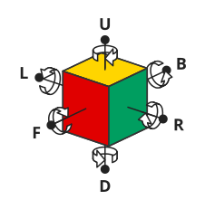{ width=34% } |

|                                                           |                                                           |                                                           |                                                           |                                                           |                                                           |
| :-------------------------------------------------------: | :-------------------------------------------------------: | :-------------------------------------------------------: | :-------------------------------------------------------: | :-------------------------------------------------------: | :-------------------------------------------------------: |
| 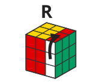{ width=100% } | 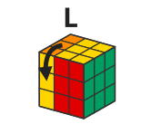{ width=100% } | 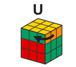{ width=100% } | 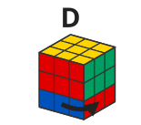{ width=100% } | 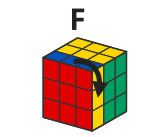{ width=100% } | 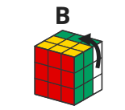{ width=100% } |
|                         **R**ight                         |                         **L**eft                          |                          **U**p                           |                         **D**own                          |                         **F**ront                         |                         **B**ack                          |

|                                                                  |                          Modifiers                          |                                                                 |                                                           |                          Slices                           |                                                           |                                                           |                         Rotations                         |                                                           |
| :--------------------------------------------------------------: | :---------------------------------------------------------: | :-------------------------------------------------------------: | :-------------------------------------------------------: | :-------------------------------------------------------: | :-------------------------------------------------------: | :-------------------------------------------------------: | :-------------------------------------------------------: | :-------------------------------------------------------: |
| 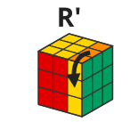{ width=100% } | 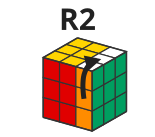{ width=100% } | 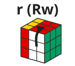{ width=100% } | 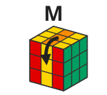{ width=100% } | 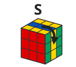{ width=100% } | 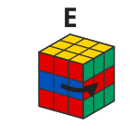{ width=100% } | 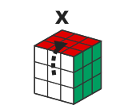{ width=100% } | 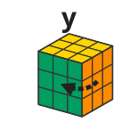{ width=100% } | 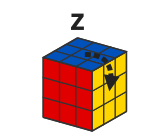{ width=100% } |
|                               CCW                                |                            180°                             |                            **w**ide                             |                        **M**id (L)                        |                       **S**tand (F)                       |                       **E**quat (D)                       |                        rotate (R)                         |                        rotate (U)                         |                        rotate (F)                         |

:::

```{=typst}
#v(8pt)
```

# Phase 1: Beginner Method

**Righty:** [`R U R' U'`]{.trig-r} — the essential trigger. **Lefty:** `L' U' L U`

:::: {.steps}

|                                                               |                                                                                                  |
| :-----------------------------------------------------------: | :----------------------------------------------------------------------------------------------- |
|  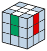{ width=55px }  | **1. Cross** — Create a white cross with each edge above its matching center. Solve intuitively. |
|   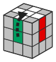{ width=55px }    | **↻ Flip** — Turn cube upside down (`x2`). White on bottom, yellow on top from now on.           |
| 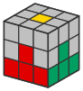{ width=55px } | **2. White Corners** — Move corner above slot:                                                   |

::: {.borderless}

|                                                             |                                                             |                                                          |
| :---------------------------------------------------------: | :---------------------------------------------------------: | :------------------------------------------------------: |
| 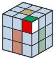{ width=50px } | 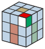{ width=50px } | 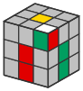{ width=50px } |
|                    [righty]{.trig-r} ×1                     |                          `y` lefty                          |                   [righty]{.trig-r} ×3                   |

:::

|                                                             |                                                      |
| :---------------------------------------------------------: | :--------------------------------------------------- |
| 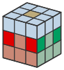{ width=55px } | **3. Edges** — Edge w/o yellow — match side, insert: |

::: {.borderless}

|                                                           |                                                          |
| :-------------------------------------------------------: | :------------------------------------------------------: |
| 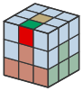{ width=50px } | 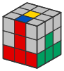{ width=50px } |
|              `U` [righty]{.trig-r} `y` lefty              |            `U'` lefty `y'` [righty]{.trig-r}             |

:::

|                                                              |                                                   |
| :----------------------------------------------------------: | :------------------------------------------------ |
| 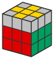{ width=55px } | **4. Yellow Cross** — `F` [righty]{.trig-r} `F'`: |

::: {.borderless}

|                                                      |     |                                                       |     |                                                       |
| :--------------------------------------------------: | :-: | :---------------------------------------------------: | :-: | :---------------------------------------------------: |
| 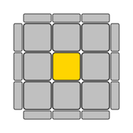{ width=60px } |  →  | 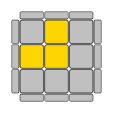{ width=60px } |  →  | 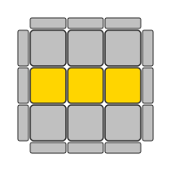{ width=60px } |
|                      **Dot** ×3                      |     |                      **Hook** ×2                      |     |                      **Line** ×1                      |

:::

|                                                              |                                                        |
| :----------------------------------------------------------: | :----------------------------------------------------- |
| 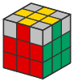{ width=55px } | **5. Align Edges** — (`R U R' U R U2 R')+U` = `Sune+U` |

::: {.borderless}

|                                                               |                                                               |
| :-----------------------------------------------------------: | :-----------------------------------------------------------: |
| 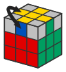{ width=50px } | 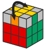{ width=50px } |
|                   **adj. edges** back+right                   |                     **opp. edges** repeat                     |

:::

|                                                                    |                                                      |
| :----------------------------------------------------------------: | :--------------------------------------------------- |
| 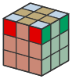{ width=55px } | **6. Pos. Corners** — `R U' L' U R' U' L` = `Niklas` |

::: {.borderless}

|                                                             |                                                                     |
| :---------------------------------------------------------: | :------------------------------------------------------------------ |
| 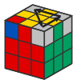{ width=50px } | Place corners correctly. `\`{=typst} Keeps front-left, cycles rest. |

:::

|                                                              |                                           |
| :----------------------------------------------------------: | :---------------------------------------- |
| 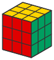{ width=55px } | **7. Orient Corners** — Flip cube (`x2`). |

::: {.borderless}

|                                                              |                                                                                                                                 |
| :----------------------------------------------------------: | :------------------------------------------------------------------------------------------------------------------------------ |
| 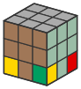{ width=50px } | Unsolved corner front-right. `\`{=typst} [Righty]{.trig-r} ×2-4 until yellow faces down. `\`{=typst} **Only D** to next corner. |

:::

::::

::: caution
**Step 7 — Orient Corners:** Flip the cube so **yellow is on bottom**. The cube looks scrambled between corners — this is normal. Repeat [righty]{.trig-r} until the current corner's yellow faces down, then turn **only D** to bring the next unsolved corner to front-right. Never rotate the whole cube or turn other faces mid-step.
:::

```{=typst}
#pagebreak()
```

# Phase 1.5: Speed Tricks

Three improvements that speed up Phase 1 with minimal new learning. Three new algorithms — the wide-`f` Hook and the two corner twists — but no new ideas: the Hook is `F-sexy-F'` with a wider grip, and the twists are one four-move trigger and that trigger inverted.

## White Cross on Bottom

Build the white cross directly on the **bottom** face instead of on top + flip. Yellow stays on top throughout. Practice inserting edges from the top layer into the bottom — once comfortable, this eliminates the flip step entirely.

## Yellow Cross (Updated)

The Hook case gets its own efficient algorithm using wide `f`:

{ width=28% }
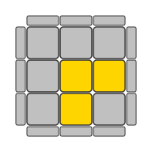{ width=15% }
{ width=28% }

| You see | Algorithm                                                           |
| ------- | ------------------------------------------------------------------- |
| Dot     | `F` [R U R' U']{.trig-r} `F'` then `f` [R U R' U']{.trig-r} `f'`    |
| Hook    | `f` [R U R' U']{.trig-r} `f'` — wide `f`, hold L in **front-right** |
| Line    | `F` [R U R' U']{.trig-r} `F'` — hold line **horizontal**            |

## Orient Corners (Updated)

Keep yellow on top — no flip needed. Move unsolved corner to **front-right**, then:

::: {.borderless}

|                                                             |                                                             |
| :---------------------------------------------------------: | :---------------------------------------------------------: |
| 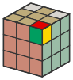{ width=50px } | 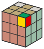{ width=50px } |
|          Yellow faces **right** → `(R' D' R D) ×2`          |          Yellow faces **front** → `(D' R' D R) ×2`          |

:::

Turn **only U** between corners to bring the next unsolved corner to front-right.

```{=typst}
#pagebreak()
```

# Phase 2: CFOP Switch (+2 Algorithms)

Switch to CFOP last-layer order: **OE → OC → PC → PE** (all orientation first, then all permutation). This never changes again.

Each section teaches ONE algorithm — enough to solve every case. Learning the pair is the natural next step — see Phase 3.

## Orient Corners: Sune

After the cross, look at the four corners. **Learn Sune — apply it repeatedly for unknown cases.**

::: algorithm
| | Case | Algorithm |
|---|------|-----------|
| 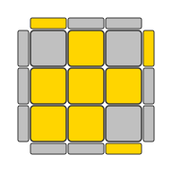{ width=60px } | **Sune** — 1 yellow corner, others CW | [`R U R' U`]{.trig-g} `R U2 R'` |
:::

For any unrecognized corner pattern, apply Sune until you reach a solved or Sune state. Anti-Sune + the remaining 5 corner cases are in Phase 3.

## Permute Corners: T-Perm

Yellow face complete. Check side colors for **headlights** (two matching corners on one face).

::: algorithm
| | Case | Algorithm |
|---|------|-----------|
| 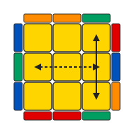{ width=60px } | **T-Perm** — headlights on one face, hold at **left** | [R U R' U']{.trig-r} [R' F]{.trig-b} `R2 U' R'` `U'` [R U R' F']{.trig-r} |
:::

- **No headlights (diagonal swap)?** Apply T-Perm → creates headlights → T-Perm again.
- **All corners match?** Skip.

Y-Perm (dedicated diagonal solver) in Phase 3.

::: caution
Niklas can't be used here — it destroys the yellow face. T-Perm swaps corners while preserving it.
:::

## Permute Edges: Ub

Corners done. Turn U — find the solved edge, hold it at **back**.

::: algorithm
| | Case | Algorithm |
|---|------|-----------|
| 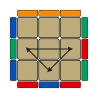{ width=60px } | **Ub** — front edge → left | `R2 U` [R U R' U']{.trig-r} `R' U'` `R' U R'` |
:::

- **No single solved edge?** Apply Ub → creates a solved edge → identify direction, apply again.

Ua (M-slice version) in Phase 3.

# Phase 3: Complete 2-Look CFOP (+10 Algorithms)

Every OLL and PLL case now solved in **one algorithm**. This phase introduces M-slice moves and completes each algorithm pair.

## Orient Corners: Anti-Sune + 5 New Cases

Anti-Sune completes the Sune pair. The remaining 5 cases each have a dedicated algorithm.

::: algorithm
| | Case | Algorithm |
|---|------|-----------|
| 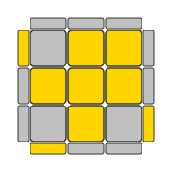{ width=60px } | **Anti-Sune** — 1 yellow corner, others CCW | `R U2 R' U' R U' R'` |
| 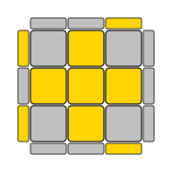{ width=60px } | **Pi** — 0 yellow, headlights **left only** | `f` [R U R' U']{.trig-r} `f' F` [R U R' U']{.trig-r} `F'` |
| 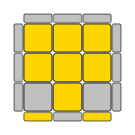{ width=60px } | **Headlights** — 2 yellow at back, headlights facing you | `R2 D R' U2 R D' R' U2 R'` |
| 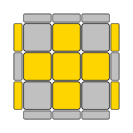{ width=60px } | **Double Headlights** — 0 yellow, headlights L+R | [R U R' U]{.trig-g} `R U' R' U R U2 R'` |
| 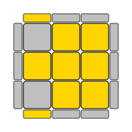{ width=60px } | **Chameleon** — 2 adjacent yellow (right) | `r U R' U' r'` [F R F']{.trig-b} |
| 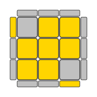{ width=60px } | **Bowtie** — 2 diagonal yellow | `F' r U R' U' r'` `F R` |
:::

## Permute Corners: Y-Perm

Completes the T-Perm pair. Solves diagonal corner swaps directly (no double T-Perm needed).

::: algorithm
| | Case | Algorithm |
|---|------|-----------|
| 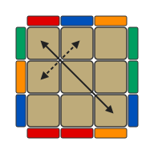{ width=60px } | **Y-Perm** — no headlights, any angle | `F R U' R' U'` [R U R' F']{.trig-r} [R U R' U']{.trig-r} [R' F R F']{.trig-b} |
:::

## Permute Edges: Ua + H-Perm + Z-Perm

**M-slice moves** (`M` turns the middle layer like `L`). Practice `M2` until smooth — Ua, H-Perm, and Z-Perm all use it.

::: algorithm
| | Case | Algorithm |
|---|------|-----------|
| 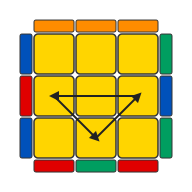{ width=60px } | **Ua** — front edge → right | `M2 U M U2 M' U M2` |
| 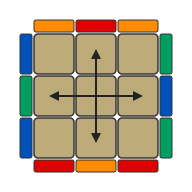{ width=60px } | **H-Perm** — opposite swap | `M2 U' M2 U2 M2 U' M2` |
| 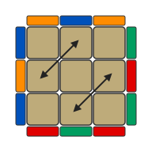{ width=60px } | **Z-Perm** — adjacent swap | `M' U' M2 U' M2 U' M' U2 M2 U` |
:::

**H vs Z:** No edges match after any U turn. Opposite colors facing each other = H. Adjacent colors = Z.

# Algorithm Reference

| Phase | Algorithm                                                                           | Name       | Step          |
| ----- | ----------------------------------------------------------------------------------- | ---------- | ------------- |
| 1     | [`R U R' U'`]{.trig-r}                                                              | Sexy Move  | Everywhere    |
| 1     | `L' U' L U`                                                                         | Lefty      | White corners |
| 1     | `U` [`R U R' U'`]{.trig-r} `y` `L' U' L U`                                          | Edge Insert Right | Middle edge |
| 1     | `U'` `L' U' L U` `y'` [`R U R' U'`]{.trig-r}                                        | Edge Insert Left | Middle edge |
| 1     | `F` [`R U R' U'`]{.trig-r} `F'`                                                     | F-sexy-F'  | OE            |
| 1     | [`R U R' U`]{.trig-g} `R U2 R'`                                                     | Sune       | PE (+U)       |
| 1     | `R U' L' U R' U' L`                                                                 | Niklas     | PC            |
| 1     | Repeat [`R U R' U'`]{.trig-r} + flip                                                | —          | OC            |
| 1.5   | `f` [`R U R' U'`]{.trig-r} `f'`                                                     | f-sexy-f'  | OE (Hook)     |
| 1.5   | `R' D' R D R' D' R D`                                                               | Orient Corners Right | OC      |
| 1.5   | `D' R' D R D' R' D R`                                                               | Orient Corners Front | OC      |
| 2     | [`R U R' U`]{.trig-g} `R U2 R'`                                                     | Sune       | OC            |
| 2     | [`R U R' U'`]{.trig-r} [`R' F`]{.trig-b} `R2 U' R' U'` [`R U R' F'`]{.trig-r}       | T-Perm     | PC            |
| 2     | `R2 U` [`R U R' U'`]{.trig-r} `R' U' R' U R'`                                       | Ub         | PE            |
| 3     | `R U2 R' U' R U' R'`                                                                | Anti-Sune  | OC            |
| 3     | `f` [`R U R' U'`]{.trig-r} `f' F` [`R U R' U'`]{.trig-r} `F'`                       | Pi         | OC            |
| 3     | `R2 D R' U2 R D' R' U2 R'`                                                          | Headlights | OC            |
| 3     | [`R U R' U`]{.trig-g} `R U' R' U R U2 R'`                                           | Double Headlights | OC     |
| 3     | `r U R' U' r'` [`F R F'`]{.trig-b}                                                  | Chameleon  | OC            |
| 3     | `F' r U R' U' r' F R`                                                               | Bowtie     | OC            |
| 3     | `F R U' R' U'` [`R U R' F'`]{.trig-r} [`R U R' U'`]{.trig-r} [`R' F R F'`]{.trig-b} | Y-Perm     | PC            |
| 3     | `M2 U M U2 M' U M2`                                                                 | Ua         | PE            |
| 3     | `M2 U' M2 U2 M2 U' M2`                                                              | H-Perm     | PE            |
| 3     | `M' U' M2 U' M2 U' M' U2 M2 U`                                                      | Z-Perm     | PE            |

## Progression

| Phase             | New | Total | LL Order          |
| ----------------- | --- | ----- | ----------------- |
| 1: Beginner       | 7   | 7     | OE → PE → PC → OC |
| 1.5: Speed Tricks | +3  | 10    | OE → PE → PC → OC |
| 2: CFOP Switch    | +2  | 12    | OE → OC → PC → PE |
| 3: Full 2-Look    | +10 | 22    | OE → OC → PC → PE |

**Total** counts algorithms *learned*. Phase 2 retires three beginner-order tools — Niklas, and both Orient Corners finishers — because orienting corners first leaves them no job. The finished method therefore runs on **19**: fifteen last-layer algorithms (2 OE, 7 OC, 2 PC, 4 PE) plus the four you use below the last layer.

# What's Next

Everything here assumes Phase 3 above: the full two-look last layer, 2-look OLL
then 2-look PLL. That four-look finish comes first and is a prerequisite for
what follows, not an alternative to it.

Then take these three in order — the ordering is the advice:

1. **F2L** — replace beginner corner+edge insertion with intuitive pairs. The biggest single speed improvement, and not a memorisation problem: drill it, don't look it up. This is what takes you under 30 seconds, and no last-layer algorithm buys that back.
2. **Full PLL** (21 algorithms) — a closed set of 21 states you tell apart by sight, taking the permute step from two algorithms to one. Printed in full on card 3 of the [card set](https://cubepath-six.vercel.app/print).
3. **Full OLL** (57 algorithms) — last, because 22 of the 57 differ only by a sliver on a side face. Drill it with randomised setups rather than a table.

After those, **cross planning** and **look-ahead** — skills, not case lists.
